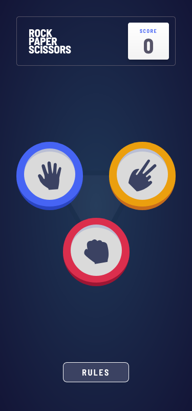
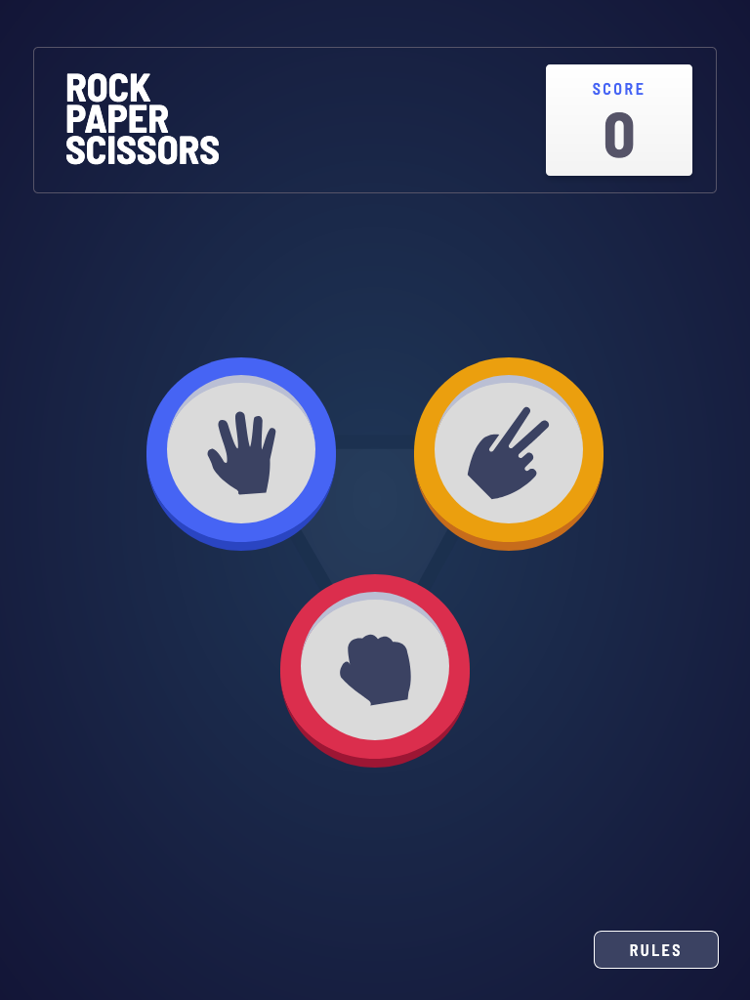
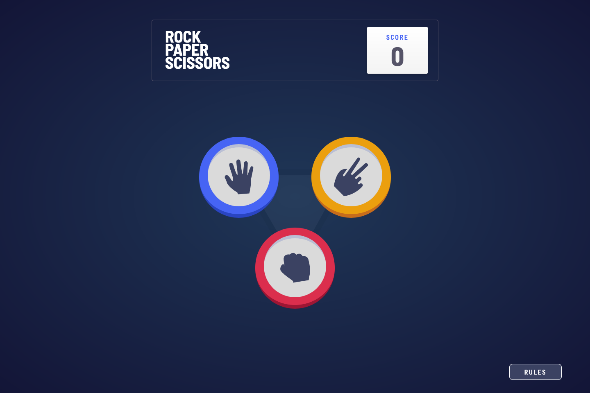

# Frontend Mentor - Rock Paper Scissors solution

This is a solution to the [Rock Paper Scissors challenge on Frontend Mentor](https://www.frontendmentor.io/challenges/rock-paper-scissors-game-pTgwgvgH). Frontend Mentor challenges help you improve your coding skills by building realistic projects.

## Table of contents

- [Frontend Mentor - Rock Paper Scissors solution](#frontend-mentor---rock-paper-scissors-solution)
  - [Table of contents](#table-of-contents)
  - [Overview](#overview)
    - [The challenge](#the-challenge)
    - [Screenshot](#screenshot)
    - [Links](#links)
  - [My process](#my-process)
    - [Built with](#built-with)
    - [What I learned](#what-i-learned)
    - [Continued development](#continued-development)
    - [Useful resources](#useful-resources)
  - [Author](#author)

## Overview

### The challenge

Users should be able to:

- Play Rock, Paper, Scissors against the computer
- View the optimal layout for the interface depending on their device's screen size
- See hover and focus states for all interactive elements on the page
- **Bonus**: Maintain the state of the score after refreshing the browser
- **Bonus**: Play Rock, Paper, Scissors, Lizard, Spock against the computer

### Screenshot

  
  
  

### Links

- Solution URL: [Frontend Mentor](https://www.frontendmentor.io/solutions/responsive-developer-portfolio-3fx7bhvfAF)
- Live Site URL: [Vercel](https://single-page-developer-portfolio-mocha-kappa.vercel.app/)

## My process

### Built with

- Semantic HTML5 markup
- CSS custom properties
- CSS Grid
- Mobile-first workflow
- [Vue 3](https://vuejs.org/) - JS library
- [Vite](https://vite.dev/) - React framework
- [TailwindCSS 4](tailwindcss.com/) - Tailwind CSS Library
- [Storybook](https://storybook.js.org/) - Storybook

### What I learned

This is my first project using Vue. I'm pretty happy with how it turned out, just from reading the docs I got a good handle on the syntax and I was able to split the components into a structure that works.

The project also gave me a chance to try out the new Tailwind 4.

As a bonus, I tried to implement animations into the project, which was a little challeging. Thankfully I figured out that Vue supports animations in its lifecycles hooks which made it a lot easier to do the animations I wanted.

### Continued development

Before implementing the bonus features set by the challenge, my plan is to implement a small example API and integrate the game with it to make it possible to play against other humans.

### Useful resources

- [Vue 3 Animation Techniques](https://vuejs.org/guide/extras/animation) - This guide was a great resource to learn how to animate components in Vue. In my case I wanted to animate the score, to make it look like a slot machine, which requires manipulating both the old and new value of the score.

## Author

- Website - TBD
- Frontend Mentor - [@marxguimaraes](https://www.frontendmentor.io/profile/marxguimaraes)
